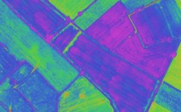
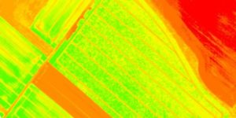
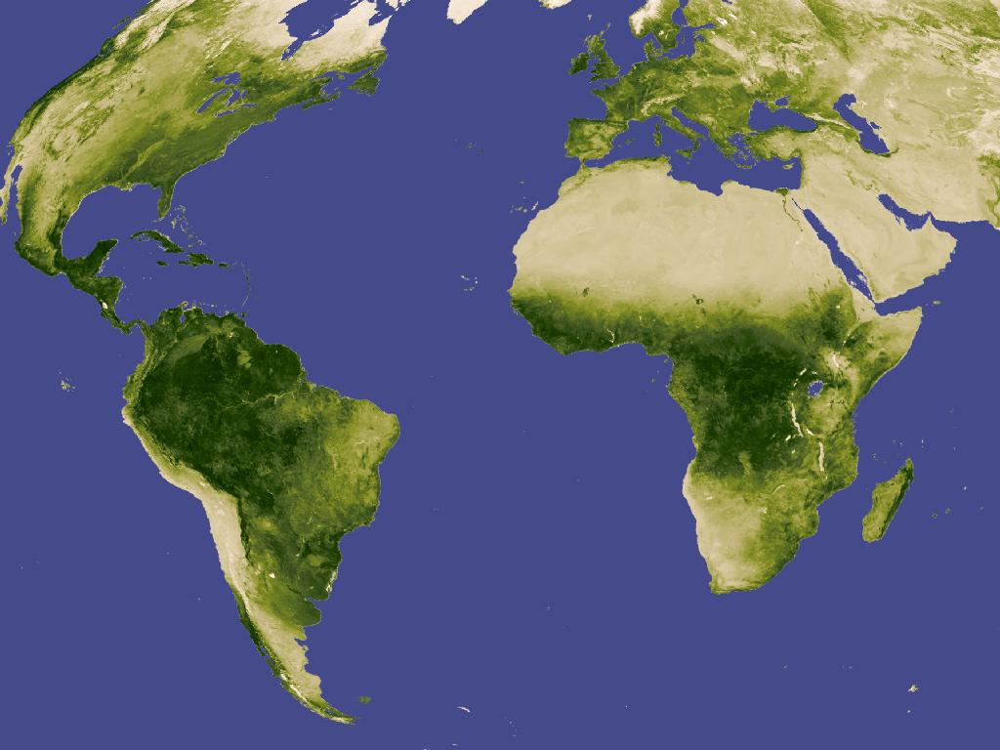
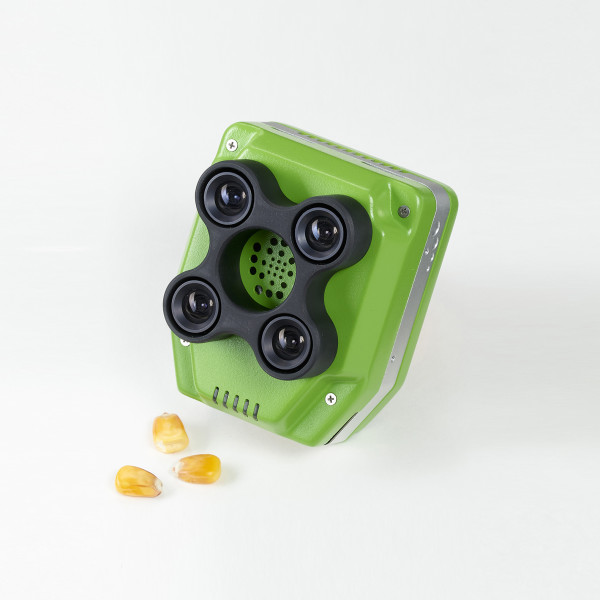

# Obrazowanie multispektralne

[TODO](https://www.dronezon.com/learn-about-drones-quadcopters/multispectral-sensor-drones-in-farming-yield-big-benefits/)

Obrazy multispektralne i hiperspektralne są przydatne przy badaniu rozkładu populacji drzewostanów. Dokładna analiza światła odbitego od roślin pozwala na wykrycie obecności określonych gatunków drzew, a także wskazuje ich ogólny "stan zdrowia".
Najprostszym kryterium oceny wegetacji na danym obszarze jest wskaźnik [Normalized Difference Vegetation Index (NDVI)](https://en.wikipedia.org/wiki/Normalized_difference_vegetation_index), który bierze pod uwagę natężenie światła bliskiej podczerwieni oraz świtła czerwonego.

Bardziej rozbudowanym jest [Enhanced vegetation index](https://en.wikipedia.org/wiki/Enhanced_vegetation_index).

Obrazowanie hiperspektralne jest doskonałym narzędziem pozwalającym na zdalne wykrywanie zanieczyszczeń środowiska. Substance chemiczne, zwłaszcza organiczne mają charakterystyczne widma emisji i absorpcji fal elektromagnetycznych; obrazowanie hiperspektralne pozwala na identyfikację śladów nielegalnej (lub awaryjnej) emisji zanieczyszczeń.
W leśnictwie wysokorozdzielcze zdjęcia multi i hiperspektralne pozwalają na identyfikację określonych gatunków drzew, a także ocenę stanu drzewostanów np. kondycji roślij, fazy kwitnienia, pylenia, infekcji pasożytniczych.

## Sentera Quad Sensor

[Sentera Quad Sensor](https://sentera.com/product/sentera-quad-sensor/) jest kamerą wielospektralną przystosowaną do zastosowań rolniczych na dronach. 
Cena: $4,599–$5,448

Specyfikacja:

- 1x 1.2MP CMOS RGB
- 3X 1.2MP CMOS Mono
    - 655nm CWL x 40nm width
    - 725nm CWL x 25nm width
    - 800nm CWL x 25nm width
- Global Shutter
- 32GB SD card per sensor (~200,000 JPEG images per card)
- 50° horizontal FOV / 39° vertical FOV
- 76mm x 62mm x 48mm (3” x 2.45” x 1.9”)
- Weight: 170 grams
