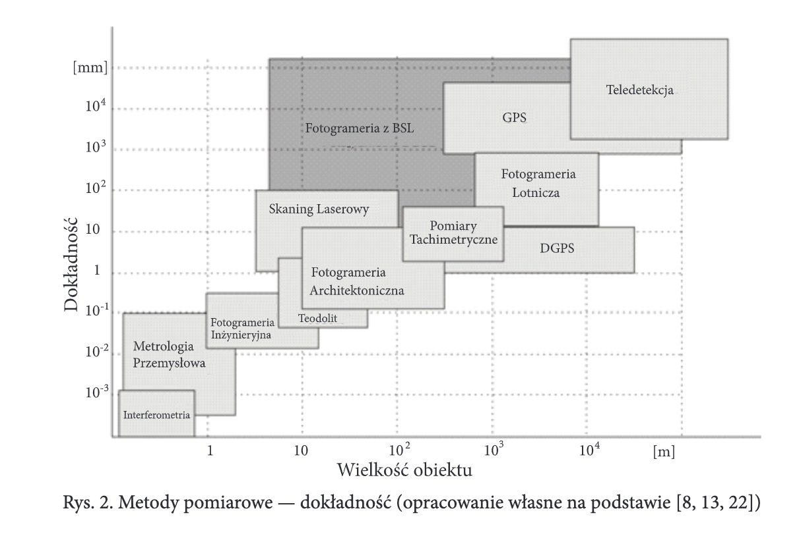
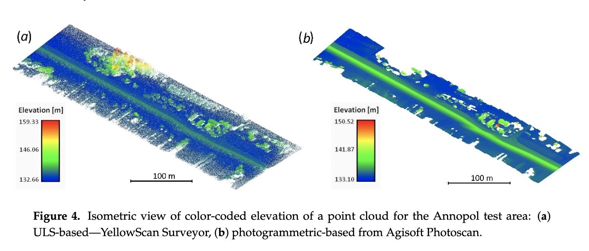

# Porównanie Fotogrametrii z ULS

Lidar:
 - Wysoki koszt
 - Wysoka waga

Kiedy dokładność metody DIM jest wystarczająca, i warunki lotu są odpowienie, skanowany teren nie porasta wysoka roślinność, fotogrametria może okazać się lepszym wyborem. 

[TODO](https://geoawesomeness.com/drone-lidar-or-photogrammetry-everything-your-need-to-know/)

## Zastosowanie w wałach przeciwpowodziowych

