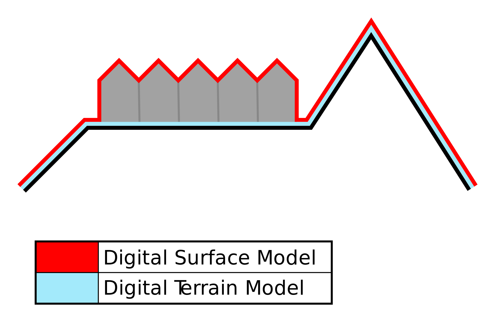

# Numeryczny Model Terenu

NMT, czyli Numeryczny Model Terenu (ang. DEM - Digital Elevation Model) jest numeryczną reprezentacją wysokości topograficznej powierzni terenu. Dodatkowo dzieli się na:

1. model terenu *digital terrain model* (DTM)
2. model powierzchni *digital surface model* (DSM)

Różnice między nimi dobrze ilustruje grafika 

DTM modeluje jedynie powierznie ziemi, podczas gdy DSM modeluje również wszystkie obiekty na niej występujące, takie jak  roślinność i budynki. 

**Algorytm filtrujący Axelsson'a** - todo

