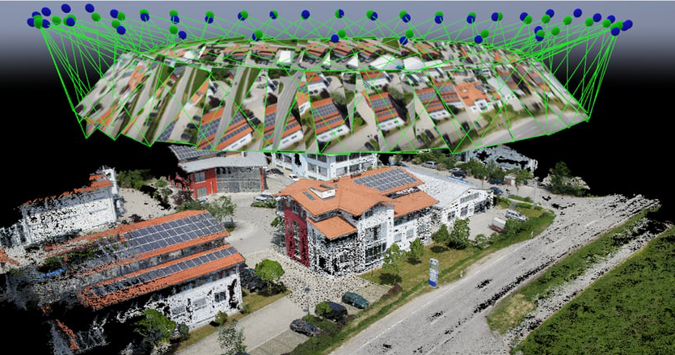
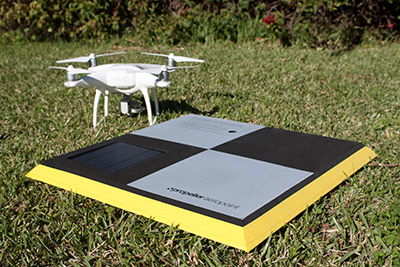
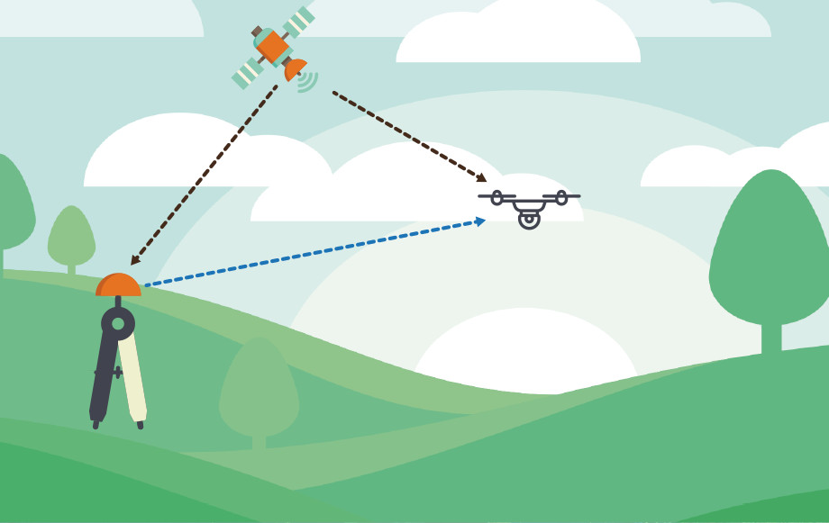
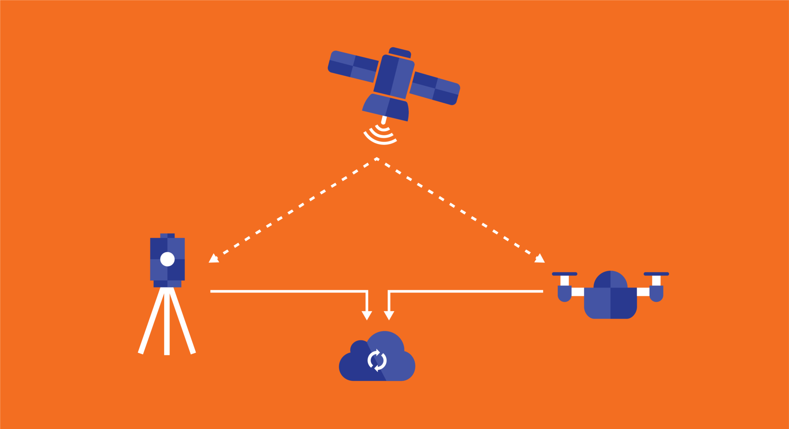

# Fotogrametria 

Wiki: dziedzina nauki i techniki zajmująca się odtwarzaniem kształtów, rozmiarów i wzajemnego położenia obiektów w terenie na podstawie zdjęć fotogrametrycznych (fotogramów).

Praktycznym zastosowaniem fotogrametrii jest jej wykorzystanie jako źródła podczas tworzenia map. W geodezji służy jako pomoc przy pomiarach dużych obszarów i odległości. Jest też jedną z metod wyznaczania wysokości obiektów.

Technika która pozwala na modelowanie terenu z wykorzystaniem zdjęć, nazywa się Dense Image Matching (DIM).
Zaletą fotogrametrii jest jej niska cena, oraz wysoką dokładność w modelowaniu DSM (poniżej 10cm) nawet z wykorzystaniem kompaktowych kamer.
Największa wadą fotogrametrii jest duża podatność na wpływ roślinności, skutkuje to dużym błędem w pionowej dokładność wynikowego modelu struktury ziemi (DTM).
Z tego powodu fotogrametria może być dobrym wyborem przy skanowaniu wałów przeciwpowodziowych, w okresie, gdy roślinność jest niska.

## Ground Control Points

W celu poprawy dokładności fotogrametrii, można zastosować punkty kontrolne (Ground Control Points - GCP). Punkty kontrolne mogą mieć postać kwadratów o rozmiarach 0.5 x 0.5 m w teksturze szachownicy w celu łatwej lokalizacji. Rozłożenie punktów kontrolnych na skanowanym terenie pozwala na uwzględnieniu ich podczas rekonstrukcji terenu. Punkty kontrolne o znanych koordynatach stają się punktami referencyjnymi przy ustalaniu koordynatów chmury punktów. Zastosowanie punktów kontrolnych pozwala na osięgnięcie sub-decymalnej dokładności pomiarów. 
Największą wadą, a zarazem wykluczającą ją z większości projektów jest czasochłonność rozstawiana takich punktów po całym terenie pomiarowym. Na całe szczęście istnieją alternatywy w postaci różnicowego GPSa.

## Różnicowy GPS 

Różnicowy GPS (ang. Differential Global Positioning System) pozwala na znaczącą poprawę dokładności systemu GPS z rzędu 15m do 1-3cm. Jest to możliwe poprzez wykorzystanie referencyjnej stacji bazowej, czyli stałego odbiornika naziemnego, ustawionego w dokładnie wyznaczonym miejscu (za pomocą pomiarów geodezyjnych). Stacja bazowa wyznacza na bieżąco poprawki różnicowe dla poszczególnych satelitów, co pozwala na wyeliminowanie większości błędów. Odbiornik ruchomy (zamontowany na dronie) musi mieć możliwość odbioru tych poprawek przez łącze bezprzewodowe. 
Istnieją dwa warianty korekcyjnego GPSa:

1. Real Time Kinematic (RTK) - korekcja pomiarów lokalizacji w czasie rzeczywistym, podczas lotu
2. Post Processing Kinematic (PPK) - korekcja pomiarów lokalizacji w post produkcji, czyli już po zebraniu danych, po zakończeniu misji.

## Ground Control Points vs RTK vs PPK

Zarówno Ground Control Points jak i technika korekcyjnego GPS pozwala na osiągnięcie sub-decymalnych dokładności, jednak różnicowy GPS nie wymaga czasochłonnej pracy związanej z przygotowaniem terenu.
Jeśli chodzi o wybór RTK a PPK, PPK okazuje się bardziej niezadowny.
RTK przejmuje wady każdego systemu czasu rzeczywistego, np. synchornizacji czasu, integracji odbiorników.
Dodatkowo PPK jest bardziej odporny na zaniki sygnału. Jest w stanie "łatać luki sygnału" znając poprzednie i następne pomiary.

## Software

Porównanie oprogramowań używanych w fotogrametrii dla map [wiki](https://en.wikipedia.org/wiki/Comparison_of_photogrammetry_software)

Moim zdaniem najlepszy będzie OpenDroneMap bo:

- jest OpenSource - mamy błogosławieństwo Stallmana
- i tutaj można by zakończyć.
- jest stworzony przez programistów dla programistów
- jest darmowy
- posiada web appke - corss platformowy, można odpalać na komuterach klientów
- jest całkiem świeży (2013)
- cały czas rozwijany

## Hardware

- Sony A6500
- Sony A6000
- Sony A5000
- Sony A7R II
- PhaseOne iXM-100
- DJI Zenmuse XT2
- DJI Zenmuse X5
- Sony RX0
- MicaSense - multispectral
- Sequoia - multispectral

