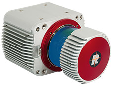

# Riegl
## RIEGL VUX-1UAV

[RIEGL VUX-1UAV](http://www.riegl.com/products/unmanned-scanning/riegl-vux-1uav/) jest lekkim i kompaktowym skanerem laserowym przystosowanym do pracy na UAVach. 
## Specyfikacja
 - Waga: 3.5kg
 - Dokładność 10mm
 - Próbkowanie 500k próbek/sek
 - Pole widzenia 330°
 - Wbudowany dysk SSD 240GB
 - Interfejs LAN-TCP/IP do trybu real-time
## RiCOPTER

[RiCOPTER](http://www.riegl.com/products/unmanned-scanning/ricopter/) jest zintegrowanym całościowym rozwiązaniem skanowania laserowego stworzonym przez firmę RIEGL. RiCOPTER to wielowirnikowiec wyposarzony w układ RIEGL VUX-SYS, który z koleji skłąda się z LiDARA VUX-1UAV, układu sensorów i nawigacji satelitarnej IMU/GNSS, układu sterującego i dwuch kamer.
## Specyfikacja
 - Składana rama z włókna węglowego w formacie X-8
 - Maksymalny payload 16kg
 - Maksymalny udźwig (Take-off Mass) 25kg
 - Długość lotu na maksymalnym obiążeniu 30 min
 - Maksymalna wysokość lotu 3km n.p.m 

