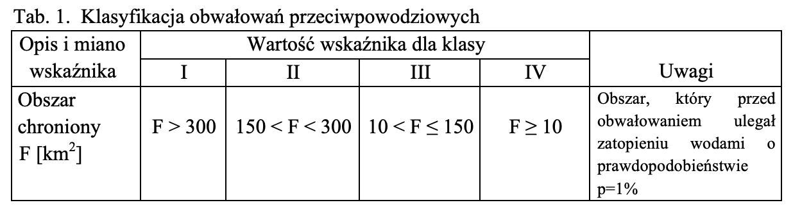
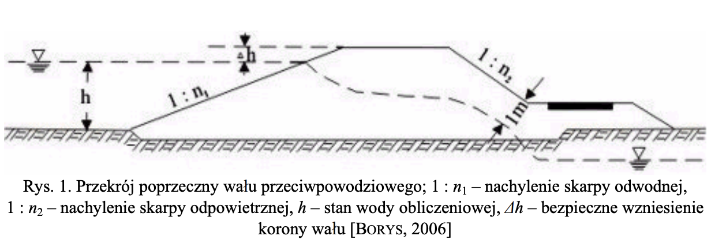
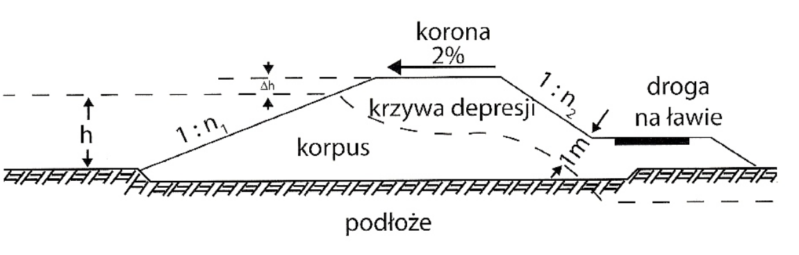
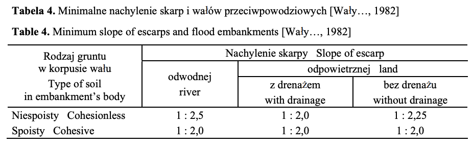

# Przepisy i Wymogi

Na bazie [tego
artykułu](http://yadda.icm.edu.pl/baztech/element/bwmeta1.element.baztech-article-BATC-0005-0056)
[ROZPORZĄDZENIE MINISTRA ŚRODOWISKA z dnia 20 kwietnia 2007 r. w sprawie
warunków technicznych, jakim powinny odpowiadać budowle hydrotechniczne i ich
usytuowanie](https://www.piib.org.pl/budownictwo-aktyprawne-61/przepisy-i-warunki-techniczno-budowlane-aktyprawne-180/1040-rozporzidzenie-ministra-brodowiska-z-dnia-20-kwietnia-2007-r-w-sprawie-warunkechnicznych-jakim-powinny-odpowiadaudowle-hydrotechniczne-i-ich-usytuowanie)

Łączna długość wałów w Polsce ~ 8.5k km. Wały chronią łącznie ~ 1.1mln ha
terenów w dolinach rzecznych i na terenach podlerowych(sprawdzić co to znaczy).
Szacuje się że 38% wymaga modernizacji, i potrzeby rosną o kilkaset km. co roku.

Kwestę wymogów dotyczących wałów przeciwpowodziowych w Polsce są zawarte w
ustawach "Prawo Wodne", "Prawo budowlane", i masa innych, ale jest to nie
istotne bo w praktyce nie jest spełniany zapis prawa budowlanego, nakładający
obowiązek wykonywania okresowych kontroli stanu technicznego obwałowań. W 2005
coroczne kontrolę zostały wykonane na 96% łącznej długości wałów,
specjalistyczne badania (co 5 lat) łącznie na 40% wałów, z czego w latach
2001-2005 tylko na 9% wałów.

Wały przeciwpowodziowe zalicza się do jednej z 4 klas budowli hydrotechnicznej,
w zależności od obszaru ochronnego danym obwałowaniem.

Dla polski:
- Klasa I - 513km ok. 6% łącznej długości wałów
- Klasa II - 2600 ok. 31% łącznej długości wałów
- Klasa III - 2000 ok. 24% łącznej długości wałów
- Klasa IV - 3000 ok. 36% łącznej długości wałów
Zdecydowana większość obwałowań (łącznie 91% ich długości) należy więc do klas
budowli hydrotechnicznych od II do IV.

Przekrój stateczny wału powinien zostać tak zaprojektowany, aby wał był
stateczny (aby się nie odkształcał) oraz aby krzywa depresji (co to znaczy ?
Chyba to dokąd nasącza się woda w wale) w korpusie obwałowania w granicznym
położeniu była oddalona od powierzchni skarpy odpowietrznej (tej gdzie nie ma
wody) nie mniej niż 1m. Czyli tak aby od strony suchej woda nie nasączała się
mocniej niż do 1m od tej skarpy.

Rzędna korony wału (jego wysokość) wynika z położenia zwierciadła wód
obliczeniowych(poziom podczas podniesionego stanu wód). Najwyższy obliczeniowy
stan wody, wyznacza się jako najwyższy ze stanów obserwowanych lub na podstawie
analizy przyczyn powstawania wyjątkowych stanów wody, takich jak zatory lodowe,
cofki wiatrowe.
Innymi słowy wysokość korony wału zależy od poziomów wód jakie może osiągać. W
artykule wszystko jest dokładnie opisane, ile metrów dla jakiego poziomu, myśle
że nie ma sensu tu tego przepisywać.

Dodatkowo wysokość należy zwiększyć jeśli, obliczenia wykonano zbyt krótko,
możliwe są zatory lodowe, międzywale może zarastać, lub może się osadzać
rumowisko (wiki. materiał stały i rozpuszczony, transportowany przez rzekę.),
będzie występowało falowanie spowodowanie wiatrem, lub ruchem statków, po
koronie będzie się odbywał ruch kołowy.

Szerokość korony powinna wynosić conajmniej:

- 4.5m - jeśli wykorzystuje się ją do komunikacji.
- 3.0m - gdy komunikacji się nie przewiduje.

W celu odwodnienia korony nasypu nadaje się jej nachylenie poprzeczne w kierunku
skarpy odwodnej, wynoszące 2%.

Nachylenie skarp korpusu wału powinno być wyznaczone na podstawie obliczeń
stateczności, przy czym nachylenia skarp nie powinny być bardziej strome niż
podane w tabeli:

Niespoisty to piasek (rozsypuje się w ręku)
Spoisty to gliny (nie rozsypuje się w ręku)

Dopuszczalne odchylenia wymiarów nasypów od projektu z uwzglęnieniem poprawek na
osiadanie są następujące:

- rzędne korony i ławek - od 0 do +10cm,
- szerokość korony i ławek - od 0 do +25cm,
- szerokośc podstawy - od 0 do +100cm,

Dopuszczalne odchylenia nachyleń skarp i spadków korony oraz ławek powinny
odpowiadać wymaganiom dotyczącym wymiarów liniowych, nie powinny jednak
przekraczać 10% projektowanego nachylenia.

Dalej opisuje na czym można a na czym nie można stawiać wałów, wolgotnośc gleby itp.

## Stan Wykonywania Okresowych Kontroli Stanu Technicznego Obwałowań

Zgodnie z ustawą "Prawo Budowlane" obiekty budowlane powinny być w czasie
użytkowania poddawane przez właściciela lub zarządcę:

- okresowej kontroli, co najmniej raz w roku, polegającej na sprawdzeniu stanu
  technicznego
- okresowej kontroli, co najmniej raz na 5 lat jw. + przydatności do użytkowania
  obiektu budowlanego.

Okresowe kontrole stanu technicznego można podzielić na:

- kontrole okresowe, które należy wykonywać co najmniej raz, ale najlepiej dwa
  razy w roku (przegląd wiosenny i jesienny);
- kontrole doraźne (awaryjne, interwencyjne), które powinno się wykonywać:
  - w okresie przepływu wielkich wód, przekraczających stan alarmowy, na których
    stwierdzono występowanie zagrożeń lub uszkodzeń wału (wzmożona filtracja,
    uszkodzenie lub odkształcenie korpusu wału).
  - w przypadku stwierdzenia uszkodzeń korpusu wału.

Kontrole te wykonywane są na ogół siłami własnymi pracowników WZMiUW.

Znacznie gorsza sytuacja panuje w zakresie wykonywania kontroli tych co 5 lat. 
W latach 2001-2005 wykonano je jedynie na 9.8% wałów. Powodem jest brak środków
finansowych.

Kolejnym problemem jest jakość wykonywanych kontroli. Znaczna ich część zawiera
jedynie wyniki rozpoznania geologicznego. Często natomiast nie zawierają
obliczeń stateczności, filtracji, nie ustosonkowują się do stanu budowli
wałóowych, stanu międzywala, nie odnoszą się do wymiarów korpusu, bezpiecznego
wzniesienia korony obwałowania, ustalenie klasy ważności budowli w świetle
najnowszych, obowiązujących w tym zakresie przepisów. 

Stan techniczny i bezpieczeństwo wałów są oceniane subiektywnie przez osobę
oceniającą, często wręcz błędnie. Dlatego stara się ustandaryzować te procedury
w skali kraju. Opracowano instrukcję zawierającą kryteria i skalę oceny stanu
technicznego i bezpieczństwa obwałowań przeciwpowodziowego. Kategorie:

0 - brak oceny ze względu na brak danych,
1 - stan zagrożenia bezpieczństwa,
2 - stan mogący zagrażać bezpieczeństwu,
3 - stan techniczny dobry, niezagrażający bezpieczeństwu.

Podjęcie decyzji o przyporządkowaniu wału do jednej z podanych kategorii powinno
wynikać z oceny stanu zasadniczych elementów obwałowania przepiwpowodziowego,
takich jak:
- korpus wału;
- podłoże bezpośrednio pod wałem oraz w terenie przyległym do wału w odległości
  do 50m od stopy wału zarówno od strony odwodnej, jak też odpowietrznej, w tym
  szczególnie na obszarze, na którym w okresie powodzi zachodzą zajwiska
  filtracyjne.
- budowle towarzyszące obwałowaniu, takie jak: pompownie, przepusty, śluzy,
  drenaże, urządzenia odwadniające, odprowadzalniki wód drenażowych, rowy
  przywałowe, przejazdy wałowe, drogi powodziowe i dojazdowe do obwałowań,
  urządzenia kontrolno-pomiarowe oraz inne elementy związane z linią ochronną
  utworzoną przez obwałowanie;
- międzywale, zawale oraz obszar chroniony.

Czynniki mogące mieć wpływ na ocenę stanu bezpieczeństwa poszczególnych
elementów obwałowania:

- Korpus wału:
  - wymiary geometryczne niespełniające wymogów, w tym:
    - bezpoeczne wzniesienie korony,
    - szerokość korony,
    - nachylenie skarp;
  - niedostateczne zagęszczenie gruntu w trakcie piętrzenia wody, w tym:
    - przecieki,
    - sufozja;
  - uszkodzenia korpusu, w tym:
    - zniszczenia korony i skarp przez przejeżdzający sprzęt,
    - lokalne osuwiska skarp,
    - stan ubezpieczeń skarp,
    - dziko rosnąca roślinność krzewiasta i drzewiasta w obrębie samego korpusu,
      jak też w terenie bezpośrednioprzyległym do wału,
    - siedliska zwierząt drążących nory, szczególnie bobrów i lisów,
    - stan korpusu w miejscach przejścia przez korpus rurociągów (wodociągowych,
      kanalizacyjnych, gazowych i innych) i kabli, szczególnie w przypadkach ich
      ułożenia w korpusie wzdłuż trasy wału,
      występowanie w korpusie wału piwnic, bunkrów i innych budowli tego typu;
  - zagrożenie stateczniści;
  - nadmierne osiadanie.

- Podłoże:
  - zjawiska filtracyjne, w tym: przecieki, sufozja, przebicia;
  - zapadliska.
- Budowle towarzyszące:
  - uszkodzenie budowli, brak sprawności technicznej;
  - brak lub zły stan dróg powodziowych i dojazdowych do obwałowania.
- Międzywale, zawale i obszar chroniony:
  - lokalne zwiężenie międzywala, mogące wpływać na utrudnienie przepływu wód.
  - roślinność występująca w międzywalu, mogąca wpływać na poziom i kierunek
    przepływu wielkich wód;
  - przecięcie trasy obwałowania ze starorzeczami, stan starorzeczy;
  - obecność wyrobisk eksploatacji kruszywa, lokalnych zagłębień terenowych,
    stawów rybnych, oczek wodnych w ogległości mniejszej niż 50m od obwałowania;
  - położenie bezpośrednio przy trasie obwałowania budynków;
  - położenie obwałowania na terenie zagrożonym szkodami górniczymi.

Bardzo częstą przyczyną powstawania uszkodzeń obwałowań jest zbyt niski poziom
korony wałów. W wyniku przelania się wody przez kornoę następuje rozmycie skarpy
i w efekcie zniszczenie całego korpusu.
Istniejące wały najczęściej nie
spełniają aktualnych wymagań dotyczących ich wysokości, gdyż:

- były budowane w czasie, gdy obowiązywały inne przepisy, lub inne były poglądy
  na temat wymagań w zakresie stopnia zabezpieczenia;
- zwiększyły się przepływy miarodajne i kontrolne;
- podniósł się stan wody w warunkach niezmienionego natężenia przepływu;
- nastąpiło podwyższenie klasy obwałowańm co wymaga zmiany ich wysokości;
- nastąpiło lokalne nadmierne osiadanie wału, spowodowane występowaniem słabych
  gruntów w podłożu.

Na stan wału i na wynikające z niego zagorżenia stateczności może też istotne
wpłynąć działanie zwierząt (bobry i lisy), zwłaszcza gdy grążą bardzo obszerne
jamy i korytarze, czasami na całej szerokości korpusu wału. Bardzo istotną rolą

## Co możemy wykrywać

- czy geometria wału nie odbiega od wymagań Prawa Budowlanego:
  - Czy korona wału ma 3 lub 4.5m
  - Czy nachylenie wału ma 1:n stopni.
  - Czy błąd jest większy niż 10%
- czy na korpusie nie rośnie jakaś roslinność
- czy jakaś roślinność nie rośnie 3m od wału (obie strony). Drzewa ułatwiają
  filtracje.
