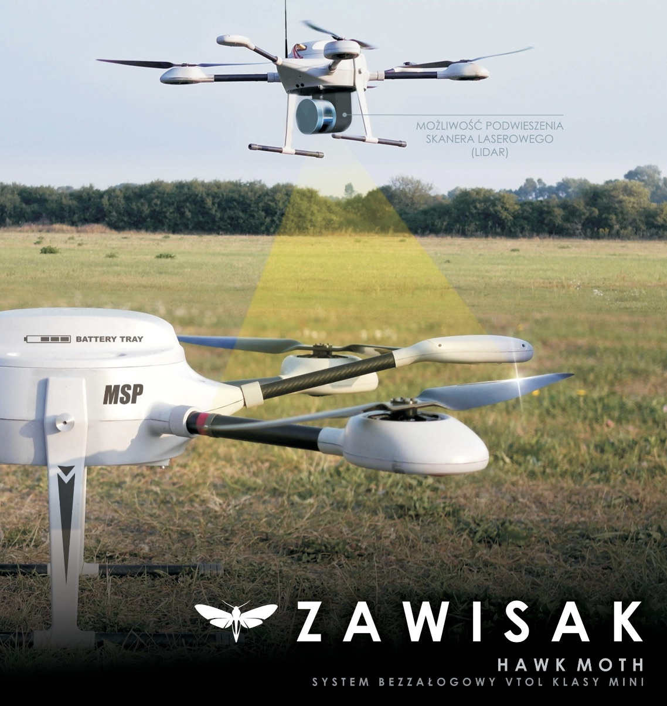

# ZAWISAK

Wielowirnikowiec [ZAWISAK](https://uav.com.pl/pl/co-robimy/bsl/zawisak) produkcji firmy [MSP](https://uav.com.pl/pl)

## Specyfikacja

Masy:

- masa pustego wielowirnikowca: 8,5 kg

- maksymalna masa płatna: 4 kg

- maksymalna masa startowa: 16 kg

Prędkości:

- prędkość lotu: 5 m/s
- maksymalna prędkość lotu: 12,5 m/s

Wyposażenie celowe:

- stabilizowana głowica obserwacyjna

- głowica fotogrametryczna [RGB Sony a6000](https://www.dxomark.com/Cameras/Sony/A6000---Specifications) rozdzielczość 2cm powierzchni ziemi. Sensor APS-C CMOS 24.3MPix, with Sony E-Mount 16mm with F/2.8 lens. Waga 0.47kg

- głowica skanująca (LIDAR) [Yellowscan Surveyor](https://www.yellowscan-lidar.com/products/yellowscan-surveyor) (możliwa zamiana na [Riegl miniVUX](http://www.riegl.com/products/unmanned-scanning/riegl-minivux-1uav/))  180próbek / m^2^ 
  

